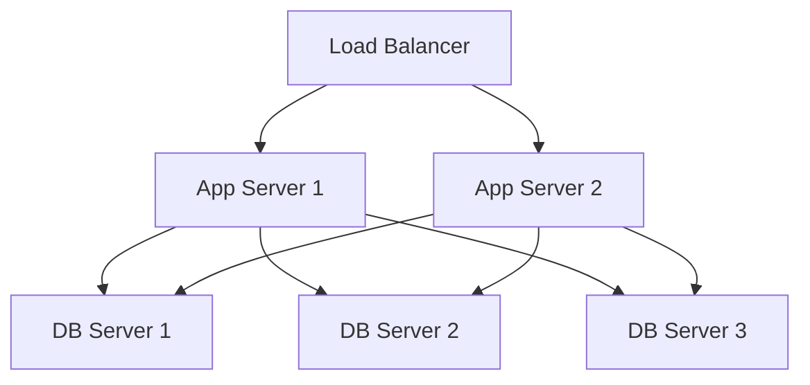

```
<script>
    var callback = function(){
        alert('A callback was triggered');
    }
<script>
```

<!--stackedit_data:
eyJoaXN0b3J5IjpbLTIwNDE2NjEzMDIsMTUyNjE4NTQyNSwyMT
M3NTA3OTM4LC0yODU5Mjg2NTYsNzI1OTc3MTI4XX0=
-->